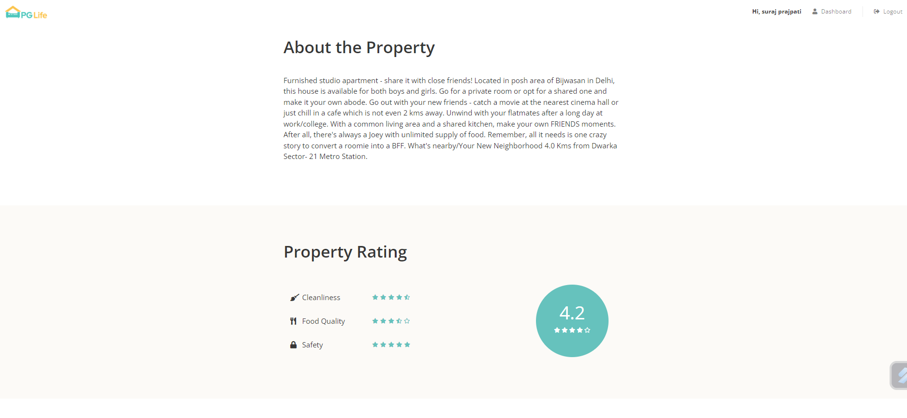

# PGLife

PGLife is a web application designed to help users find available Paying Guest (PG) accommodations in different cities. It provides a convenient way to search for PGs, like preferred properties, and manage them through a user-friendly dashboard. The project utilizes PHP and ReactJS to deliver a seamless and interactive experience.

## Key Features

- **City Search:** Easily search for available PGs in your desired city from the homepage.
- **User Registration and Login:** Register as a new user or log in with your existing credentials to access personalized features.
- **Property Like System:** Like the properties you find interesting, and they will be saved in your dashboard for quick reference.
- **Filter Bar:** Utilize the filter bar to refine your search based on specific criteria such as location, amenities, price range, etc.
- **Property Details:** Get detailed information about each property, including images, amenities, pricing, contact details, and more.

## How to Run the Application

1. Clone the repository to your local machine.
2. Set up the PHP backend by configuring the necessary dependencies and database connections.
3. Set up the ReactJS frontend by installing the required packages and configuring the environment variables.
4. Run the PHP server to handle backend requests and serve the API endpoints.
5. Run the ReactJS development server to launch the frontend application.
6. Access the application through your preferred web browser and start searching for PGs in various cities.

## Screenshots

Here are some screenshots showcasing the user interface and features of the PGLife application:

## Contribution

Contributions to the PGLife project are welcome! If you have any suggestions, improvements, or bug fixes, please feel free to submit a pull request. Let's make finding PG accommodations easier and more convenient for everyone.

